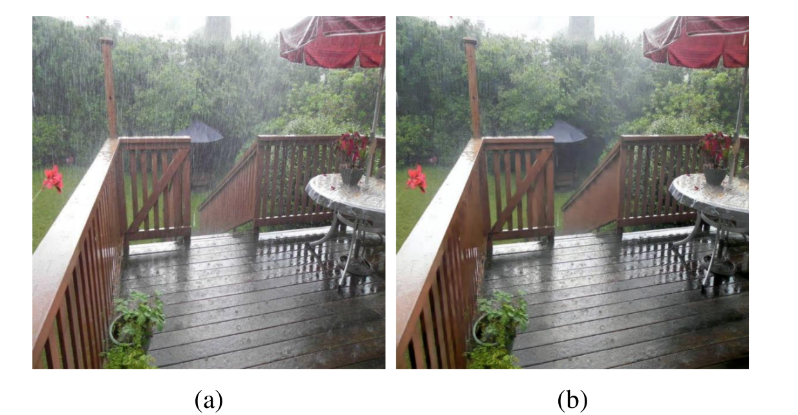
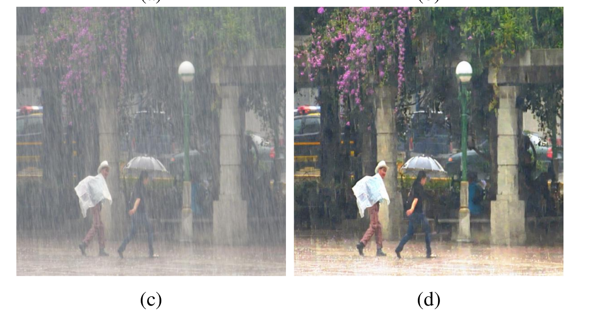

ID-CGAN

[[Arxiv](https://128.84.21.199/abs/1701.05957)]

Image De-raining Using a Conditional Generative Adversarial Network

He Zhang, Vishwanath Sindagi, Vishal M. Patel

In this paper, we are investating a new point new in addressing single image de-raining problem. Instead of focusing only on deciding what is a good prior or a good framework to achieve good quantitative and qualitative performance, we also ensure that the de-rained image itself does not degrade the performance of a given computer vision algorithm such as detection and classification. In other words, the de-rained result should be indistinguishable from its corresponding clear image to a given discriminator. This criterion can be directly incorporated into the optimization framework by using the recently introduced conditional generative adversarial networks (GANs). To minimize artifacts introduced by GANs and ensure better visual quality, a new refined loss function is introduced.

## Prepare
Instal torch7

Install nngraph

Install hdf5
 
Download the dataset from (https://drive.google.com/open?id=0Bw2e6Q0nQQvGbi1xV1Yxd09rY2s) 
and put the dataset folder into the "IDGAN" folder

## Training

	DATA_ROOT=./datasets/rain name=rain which_direction=BtoA th train.lua  

## Testing

	DATA_ROOT=./datasets/rain name=rain which_direction=BtoA phase=test_nature th test.lua

##  Testing using IDGAN model
The trained IDGAN model  and our training and testing datasets can be found at 
(https://drive.google.com/open?id=0Bw2e6Q0nQQvGbi1xV1Yxd09rY2s)

*Make sure you download the vgg model that used for perceotual loss and put it in the ./IDGAN/per_loss/models

Acknowledgments

Code borrows heavily from [[pix2pix](https://github.com/phillipi/pix2pix)]
 and [[Perceptual Loss](https://github.com/jcjohnson/fast-neural-style)]. Thanks for the sharing.
